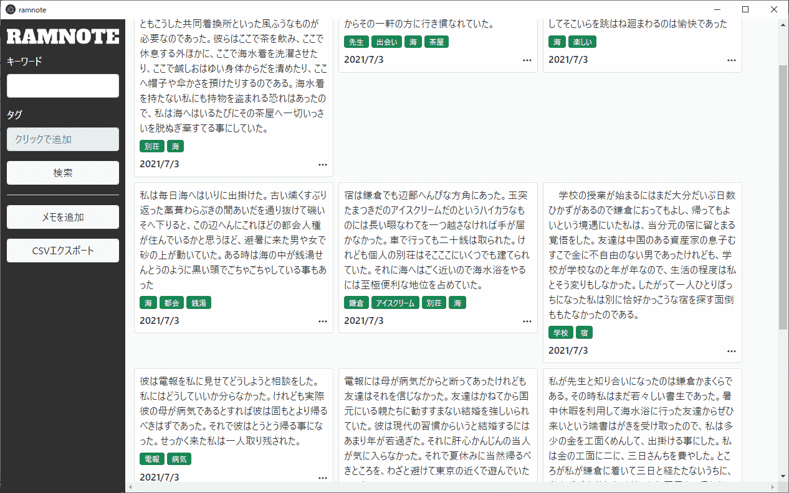

# RAMNOTE

## 概要
* メモを取るアプリ
* タグ機能
* 検索機能
* CSVエクスポート機能
* デスクトップアプリ・Webアプリどちらでも動作

## 現在の開発環境

* node v14.15.4
* python 3.9

## 使用ライブラリ

### クライアント（TypeScript）
* Vue 3
* Electron
* など

### サーバー（Python）
* flask
* など

## ライセンス
GPL3